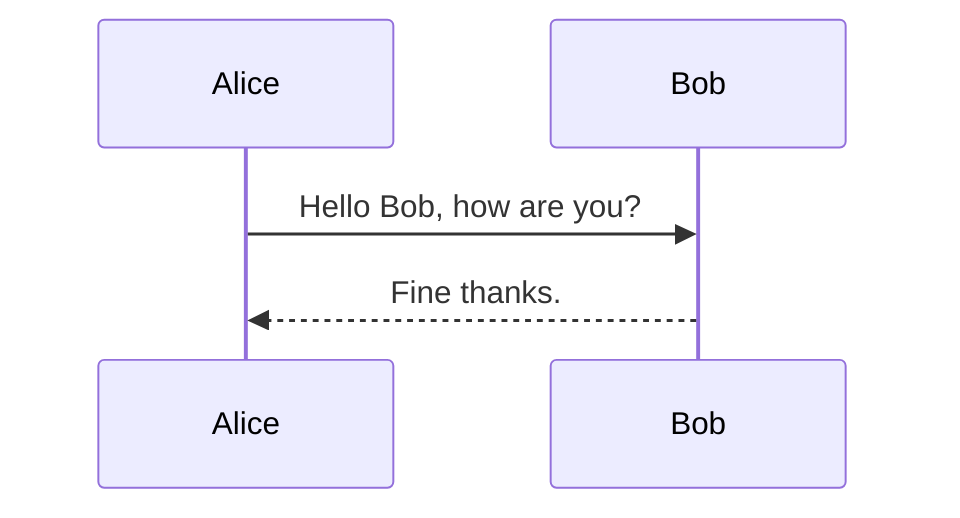

# Centralised Vs Decentralised Architecture

To align all stakeholders on FMAR's strategic vision and core use cases, and make a **key architectural decision.**

Should FMAR be built as a **Consolidated Register (single source of truth)** or a **Federated Register (connected ecosystem of registers)**?

| **Criteria**            | **Consolidated Register**                          | **Federated Register**                             |
|-------------------------|----------------------------------------------------|----------------------------------------------------|
| **Data ownership**      | Centralised by FMAR                                | Retained by platforms                              |
| **Real-time access**    | Easier to optimise                                 | Latency issues if not standardised                 |
| **Privacy compliance**  | Central consent framework                          | Complex cross-platform consent sharing             |
| **Integration effort**  | High initial, low ongoing                          | Lower initial, high ongoing sync overhead          |
| **Trust & validation**  | FMAR validates                                     | Relies on external validation                      |
| **Go-live speed**       | Slower                                             | Faster (reuses existing APIs)                      |
| **Future scalability**  | Easier to evolve                                   | May hit interoperability limits                    |

Keeping the cost, timelines and scope in mind, Market facilitator proposes a **centralised implementation**

## Centralised Data Architecture

A centralized data architecture is a system where all data is stored and managed in a single, central location, such as a data warehouse or data lake. This approach aims to simplify data management, improve data consistency, and enhance data governance by eliminating data silos. It allows for a unified view of data across an organization, facilitating better decision-making and strategic planning. 


### Data Storage for Centralised Architecture


### Data Retrieval for Centralised Architecture


## Federated Data Architecture
A federated data architecture is a system design where multiple independent data sources or systems are integrated to function as a single, unified entity without centralizing the data or control. It allows for accessing and analyzing data from various sources in real-time without physically moving or replicating the data. This approach maintains the autonomy of individual data sources while enabling data sharing and collaboration. 

### Data Storage for Federated Architecture


### Data Retrieval for Federated Architecture
```mermaid
sequenceDiagram
    participant Alice
    participant Bob
    Alice->>Bob: Hello Bob, how are you?
    Bob-->>Alice: Fine thanks.
